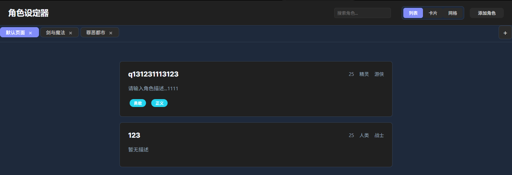
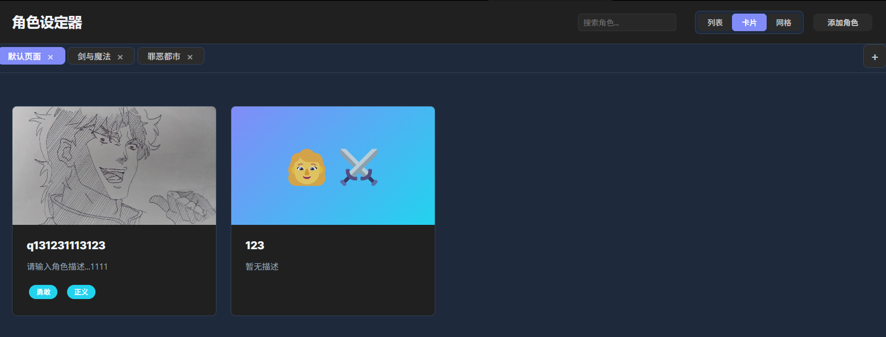
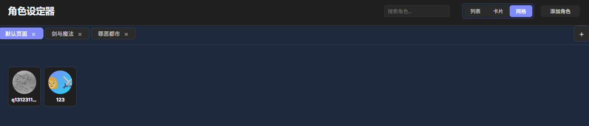
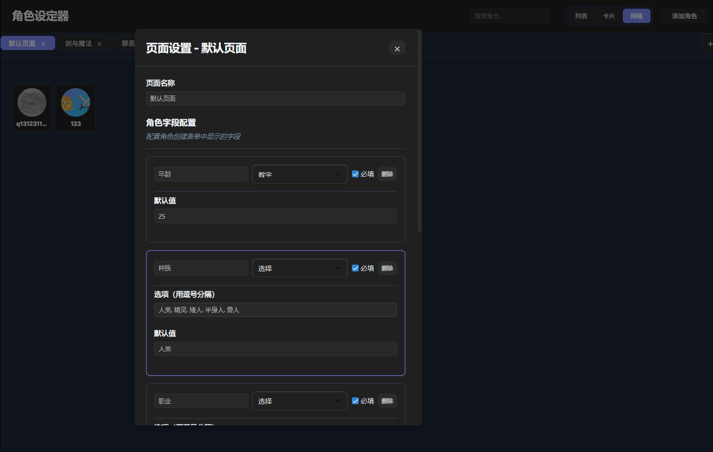

# 角色设定管理器 (Character Manager)

一个功能强大的 Obsidian 插件，专为创作者、游戏设计师、小说作者等需要管理角色设定的用户设计。支持多页面管理、动态字段配置、图片管理、搜索功能等，让角色设定管理变得简单高效。






## ✨ 主要功能

### 🎭 角色管理
- **创建角色**: 支持自定义字段的角色创建系统
- **编辑角色**: 随时修改角色的所有信息
- **角色详情**: 查看角色的完整信息和图片
- **删除角色**: 安全删除不需要的角色
- **动态字段**: 每个页面可以自定义角色字段（年龄、种族、职业、标签、描述等）

### 🖼️ 图片管理
- **多图片支持**: 为每个角色添加多张图片
- **自动重命名**: 图片上传时自动重命名，便于管理
- **图片索引**: 自动创建 `image-index.md` 文件，记录所有图片信息
- **拖拽排序**: 拖拽图片重新排序，第一张图片显示为缩略图
- **图片删除**: 点击删除按钮移除不需要的图片
- **自定义路径**: 可设置图片存储文件夹路径

### 📑 多页面管理
- **独立页面**: 创建多个独立的角色页面
- **页面切换**: 通过标签页快速切换不同页面
- **页面设置**: 右键点击标签页可以重命名和设置页面
- **角色模板**: 每个页面可以设置独立的角色字段模板
- **数据隔离**: 不同页面的角色数据完全独立

### 🔍 搜索功能
- **实时搜索**: 输入关键词即时显示搜索结果
- **多字段搜索**: 支持搜索角色名称、描述、种族、职业、标签等
- **关键词高亮**: 匹配的关键词会高亮显示
- **清空恢复**: 清空搜索框可恢复显示所有角色

### 🎨 三视图模式
- **列表视图**: 紧凑布局，显示更多详细信息
- **卡片视图**: 卡片式布局，显示图片缩略图和描述
- **网格视图**: 紧凑的缩略图网格，仅显示图片和名称

### ⚙️ 配置管理
- **插件配置**: 自定义插件显示名称
- **文件路径**: 设置数据存储和图片存储路径
- **备份恢复**: 支持手动和自动备份功能
- **数据安全**: 所有数据保存在 Obsidian 仓库中

## 🚀 快速开始

### 安装方法

1. **下载插件**
   - 下载插件文件到您的 Obsidian 插件目录
   - 或者使用 Obsidian 社区插件商店安装

2. **启用插件**
   - 在 Obsidian 设置中启用"角色设定器"插件
   - 重启 Obsidian 以确保插件正常工作

3. **打开插件**
   - 点击左侧工具栏的用户图标
   - 或使用命令面板（Ctrl/Cmd + P）搜索"打开角色设定器"

### 基本使用

#### 1. 创建第一个页面
- 点击页面标签栏的"+"按钮
- 输入页面名称（如"主要角色"、"配角"等）
- 点击"创建页面"

#### 2. 配置角色模板
- 右键点击页面标签，选择"页面设置"
- 在"角色字段配置"中添加或修改字段
- 支持字段类型：文本、数字、选择、标签、多行文本
- 设置字段是否必填

#### 3. 添加角色
- 点击"添加角色"按钮
- 填写角色名称和模板中定义的字段
- 点击"保存"完成创建

#### 4. 管理角色
- 点击角色卡片查看详情
- 在详情页面可以编辑、删除角色
- 添加和管理角色图片

## 📖 详细使用指南

### 页面管理

#### 创建页面
1. 点击页面标签栏右侧的"+"按钮
2. 输入页面名称
3. 点击"创建页面"

#### 页面设置
1. 右键点击页面标签
2. 选择"页面设置"
3. 可以修改页面名称和角色字段配置

#### 删除页面
1. 点击页面标签上的"×"按钮
2. 确认删除操作
3. 注意：删除页面会同时删除该页面的所有角色数据

### 角色字段配置

#### 字段类型说明
- **文本**: 单行文本输入
- **数字**: 数字输入，可设置范围
- **选择**: 下拉选择框，可配置多个选项
- **标签**: 多标签输入，用逗号分隔
- **多行文本**: 多行文本输入，适合描述

#### 配置步骤
1. 在页面设置中点击"添加字段"
2. 设置字段名称、类型、是否必填
3. 根据字段类型配置相应选项
4. 点击"保存设置"

### 图片管理

#### 添加图片
1. 在角色详情页面点击"添加图片"
2. 选择一张或多张图片文件
3. 图片会自动重命名并保存到指定文件夹

#### 图片设置
1. 点击"设置图片路径"按钮
2. 配置图片存储文件夹路径
3. 建议使用 `character-creator/character-images` 作为默认路径

#### 图片索引
- 插件会自动在图片文件夹中创建 `image-index.md` 文件
- 记录所有图片的原始文件名、存储路径和添加时间
- 支持 Obsidian 内部链接，可点击跳转到图片文件

### 搜索功能

#### 基本搜索
1. 在搜索框中输入关键词
2. 支持搜索角色名称、描述、种族、职业、标签等字段
3. 匹配的关键词会高亮显示

#### 高级搜索
- 支持多关键词搜索
- 不区分大小写
- 支持部分匹配

### 视图切换

#### 列表视图
- 紧凑布局，显示更多详细信息
- 适合查看角色列表和基本信息

#### 卡片视图
- 卡片式布局，显示图片缩略图和描述
- 适合浏览和快速预览

#### 网格视图
- 紧凑的缩略图网格，仅显示图片和名称
- 适合快速浏览大量角色

## ⚙️ 配置设置

### 插件配置
1. 使用命令面板搜索"配置角色设定器"
2. 可以设置：
   - 插件显示名称
   - 数据存储文件夹
   - 图片存储文件夹

### 文件路径设置
1. 使用命令面板搜索"设置文件保存路径"
2. 或点击角色详情页面的"设置图片路径"按钮
3. 配置数据存储和图片存储路径

### 默认设置
- **数据文件夹**: `character-creator`
- **图片文件夹**: `character-creator/character-images`
- **插件名称**: 角色设定管理器

## 📁 文件结构

```
your-vault/
├── character-creator/              # 数据存储文件夹（可配置）
│   ├── pages-index.json           # 页面索引文件
│   ├── page-1234567890.json      # 页面1的数据
│   ├── page-1234567891.json      # 页面2的数据
│   └── backups/                   # 备份文件夹
│       ├── manual-backup-2024-01-01T12-00-00-000Z.json
│       └── auto-backup-2024-01-01T12-00-00-000Z.json
└── character-creator/character-images/  # 图片存储文件夹（可配置）
    ├── image-index.md             # 图片索引文件
    ├── character-image-1234567890.jpg
    └── character-image-1234567891.png
```

### 图片索引文件示例

```markdown
# 角色图片索引

此文件用于记录角色设定器中使用的所有图片文件。

## 图片列表

- **原始文件名.jpg** → [[character-images/character-image-1234567890.jpg]] (添加时间: 2024-01-01T12:00:00.000Z)
- **角色头像.png** → [[character-images/character-image-1234567891.png]] (添加时间: 2024-01-01T12:01:00.000Z)
```

## 🔧 技术特性

### 核心技术
- **Obsidian API**: 完全基于 Obsidian 官方 API 开发
- **纯 JavaScript**: 无需额外依赖，轻量级实现
- **响应式设计**: 支持桌面和移动设备
- **主题适配**: 自动适配 Obsidian 的明暗主题

### 数据安全
- **本地存储**: 所有数据保存在 Obsidian 仓库中
- **版本控制**: 支持 Git 版本控制
- **备份系统**: 完整的备份和恢复机制
- **数据隔离**: 不同页面使用独立文件存储

### 性能优化
- **懒加载**: 图片按需加载
- **缓存机制**: 智能缓存减少重复请求
- **内存管理**: 优化内存使用
- **流畅交互**: 平滑的动画和过渡效果

## 🎨 自定义样式

### CSS 变量
您可以通过修改 CSS 变量来自定义界面颜色：

```css
:root {
  --character-primary: #6366f1;      /* 主色调 */
  --character-accent: #06b6d4;       /* 强调色 */
  --character-text: #1e293b;         /* 文字颜色 */
  --character-border: #e2e8f0;       /* 边框颜色 */
  --character-background: #ffffff;   /* 背景颜色 */
  --character-error: #ef4444;        /* 错误颜色 */
}
```

### 响应式断点
- **桌面**: 1200px 及以上
- **平板**: 768px - 1199px
- **手机**: 767px 及以下

## 📝 更新日志

### v1.4.0 (当前版本)
- ✨ 新增图片索引文件功能
- ✨ 图片自动重命名
- ✨ 图片路径设置按钮
- ✨ 优化图片管理体验
- 🐛 修复下拉选择框显示问题
- 🐛 修复新建角色后无法查看详情的问题

### v1.3.0
- ✨ 新增搜索功能
- ✨ 页面设置保存确认
- 🧹 删除冗余代码
- 🐛 修复各种显示问题

### v1.2.0
- ✨ 新增三视图模式（列表、卡片、网格）
- ✨ 页面右键菜单
- ✨ 动态角色模板
- 🎨 优化用户界面

### v1.1.0
- ✨ 多页面管理
- ✨ 图片上传和管理
- ✨ 数据备份和恢复
- 🐛 修复图片显示问题

### v1.0.0
- 🎉 初始版本发布
- ✨ 基础角色管理功能
- ✨ 列表和网格视图
- ✨ 基本数据存储

## 🤝 贡献指南

### 报告问题
如果您发现了问题或有功能建议，请：
1. 在 GitHub 上创建 Issue
2. 详细描述问题或建议
3. 提供复现步骤（如果是问题）

### 提交代码
如果您想贡献代码：
1. Fork 项目
2. 创建功能分支
3. 提交更改
4. 创建 Pull Request


---

**角色设定器** - 让角色管理变得简单高效 🎭
