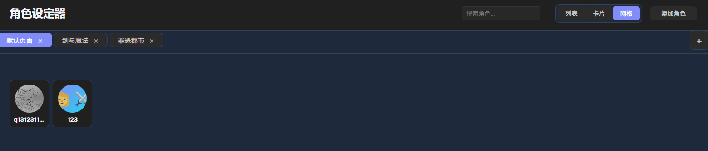
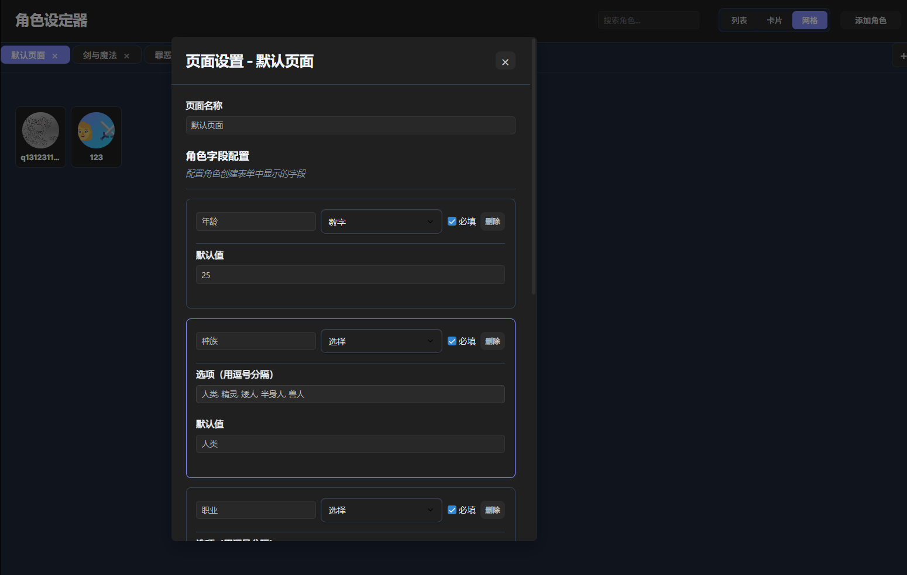

# Character Manager

A powerful Obsidian plugin designed for Managers, game designers, novelists, and anyone who needs to manage character profiles. Features multi-page management, dynamic field configuration, image management, search functionality, and more, making character profile management simple and efficient.





## ✨ Key Features

### 🎭 Character Management
- **Create Characters**: Character creation system with customizable fields
- **Edit Characters**: Modify character information at any time
- **Character Details**: View complete character information and images
- **Delete Characters**: Safely remove unwanted characters
- **Dynamic Fields**: Each page can customize character fields (age, race, class, tags, description, etc.)

### 🖼️ Image Management
- **Multiple Images**: Add multiple images for each character
- **Auto Rename**: Images are automatically renamed for easy management
- **Image Index**: Automatically creates `image-index.md` file to record all image information
- **Drag & Drop**: Drag images to reorder, with the first image displayed as thumbnail
- **Image Deletion**: Click delete button to remove unwanted images
- **Custom Path**: Set custom image storage folder path

### 📑 Multi-Page Management
- **Independent Pages**: Create multiple independent character pages
- **Page Switching**: Quickly switch between different pages via tabs
- **Page Settings**: Right-click tab to rename and configure pages
- **Character Templates**: Each page can set independent character field templates
- **Data Isolation**: Character data from different pages is completely independent

### 🔍 Search Functionality
- **Real-time Search**: Enter keywords to instantly display search results
- **Multi-field Search**: Search character names, descriptions, race, class, tags, etc.
- **Keyword Highlighting**: Matching keywords are highlighted
- **Clear & Restore**: Clear search box to restore all characters

### 🎨 Three View Modes
- **List View**: Compact layout showing more detailed information
- **Card View**: Card-style layout with image thumbnails and descriptions
- **Grid View**: Compact thumbnail grid showing only images and names

### ⚙️ Configuration Management
- **Plugin Configuration**: Customize plugin display name
- **File Paths**: Set data storage and image storage paths
- **Backup & Restore**: Support manual and automatic backup functionality
- **Data Security**: All data stored in Obsidian vault

## 🚀 Quick Start

### Installation

1. **Download Plugin**
   - Download plugin files to your Obsidian plugins directory
   - Or install via Obsidian Community Plugins store

2. **Enable Plugin**
   - Enable "Character Manager" plugin in Obsidian settings
   - Restart Obsidian to ensure plugin works properly

3. **Open Plugin**
   - Click the user icon in the left toolbar
   - Or use command palette (Ctrl/Cmd + P) and search "Open Character Manager"

### Basic Usage

#### 1. Create Your First Page
- Click the "+" button in the page tab bar
- Enter page name (e.g., "Main Characters", "Supporting Characters")
- Click "Create Page"

#### 2. Configure Character Template
- Right-click page tab and select "Page Settings"
- Add or modify fields in "Character Field Configuration"
- Supported field types: Text, Number, Select, Tags, Multi-line Text
- Set whether fields are required

#### 3. Add Characters
- Click "Add Character" button
- Fill in character name and fields defined in template
- Click "Save" to complete creation

#### 4. Manage Characters
- Click character card to view details
- Edit and delete characters in detail page
- Add and manage character images

## 📖 Detailed Usage Guide

### Page Management

#### Create Page
1. Click the "+" button on the right side of page tab bar
2. Enter page name
3. Click "Create Page"

#### Page Settings
1. Right-click page tab
2. Select "Page Settings"
3. Modify page name and character field configuration

#### Delete Page
1. Click the "×" button on page tab
2. Confirm deletion
3. Note: Deleting a page will also delete all character data in that page

### Character Field Configuration

#### Field Type Description
- **Text**: Single-line text input
- **Number**: Numeric input with range settings
- **Select**: Dropdown selection with configurable options
- **Tags**: Multi-tag input separated by commas
- **Multi-line Text**: Multi-line text input suitable for descriptions

#### Configuration Steps
1. Click "Add Field" in page settings
2. Set field name, type, and whether required
3. Configure corresponding options based on field type
4. Click "Save Settings"

### Image Management

#### Add Images
1. Click "Add Image" in character detail page
2. Select one or multiple image files
3. Images will be automatically renamed and saved to specified folder

#### Image Settings
1. Click "Set Image Path" button
2. Configure image storage folder path
3. Recommended to use `character-Manager/character-images` as default path

#### Image Index
- Plugin automatically creates `image-index.md` file in image folder
- Records original filename, storage path, and addition time for all images
- Supports Obsidian internal links for direct navigation to image files

### Search Functionality

#### Basic Search
1. Enter keywords in search box
2. Supports searching character names, descriptions, race, class, tags, etc.
3. Matching keywords are highlighted

#### Advanced Search
- Supports multi-keyword search
- Case-insensitive
- Supports partial matching

### View Switching

#### List View
- Compact layout showing more detailed information
- Suitable for viewing character lists and basic information

#### Card View
- Card-style layout with image thumbnails and descriptions
- Suitable for browsing and quick preview

#### Grid View
- Compact thumbnail grid showing only images and names
- Suitable for quickly browsing large numbers of characters

## ⚙️ Configuration Settings

### Plugin Configuration
1. Use command palette to search "Configure Character Manager"
2. Can set:
   - Plugin display name
   - Data storage folder
   - Image storage folder

### File Path Settings
1. Use command palette to search "Set File Save Path"
2. Or click "Set Image Path" button in character detail page
3. Configure data storage and image storage paths

### Default Settings
- **Data Folder**: `character-Manager`
- **Image Folder**: `character-Manager/character-images`
- **Plugin Name**: Character Manager

## 📁 File Structure

```
your-vault/
├── character-Manager/              # Data storage folder (configurable)
│   ├── pages-index.json           # Page index file
│   ├── page-1234567890.json      # Page 1 data
│   ├── page-1234567891.json      # Page 2 data
│   └── backups/                   # Backup folder
│       ├── manual-backup-2024-01-01T12-00-00-000Z.json
│       └── auto-backup-2024-01-01T12-00-00-000Z.json
└── character-Manager/character-images/  # Image storage folder (configurable)
    ├── image-index.md             # Image index file
    ├── character-image-1234567890.jpg
    └── character-image-1234567891.png
```

### Image Index File Example

```markdown
# Character Image Index

This file is used to record all image files used in the Character Manager.

## Image List

- **Original filename.jpg** → [[character-images/character-image-1234567890.jpg]] (Added: 2024-01-01T12:00:00.000Z)
- **Character avatar.png** → [[character-images/character-image-1234567891.png]] (Added: 2024-01-01T12:01:00.000Z)
```

## 🔧 Technical Features

### Core Technology
- **Obsidian API**: Fully developed based on Obsidian official API
- **Pure JavaScript**: No additional dependencies, lightweight implementation
- **Responsive Design**: Supports desktop and mobile devices
- **Theme Adaptation**: Automatically adapts to Obsidian's light/dark themes

### Data Security
- **Local Storage**: All data stored in Obsidian vault
- **Version Control**: Supports Git version control
- **Backup System**: Complete backup and restore mechanism
- **Data Isolation**: Different pages use independent file storage

### Performance Optimization
- **Lazy Loading**: Images loaded on demand
- **Caching Mechanism**: Smart caching reduces repeated requests
- **Memory Management**: Optimized memory usage
- **Smooth Interaction**: Smooth animations and transitions

## 🎨 Custom Styling

### CSS Variables
You can customize interface colors by modifying CSS variables:

```css
:root {
  --character-primary: #6366f1;      /* Primary color */
  --character-accent: #06b6d4;       /* Accent color */
  --character-text: #1e293b;         /* Text color */
  --character-border: #e2e8f0;       /* Border color */
  --character-background: #ffffff;   /* Background color */
  --character-error: #ef4444;        /* Error color */
}
```

### Responsive Breakpoints
- **Desktop**: 1200px and above
- **Tablet**: 768px - 1199px
- **Mobile**: 767px and below

## 📝 Changelog

### v1.4.0 (Current Version)
- ✨ Added image index file functionality
- ✨ Image auto-rename
- ✨ Image path setting button
- ✨ Optimized image management experience
- 🐛 Fixed dropdown selection box display issues
- 🐛 Fixed issue where newly created characters couldn't be viewed

### v1.3.0
- ✨ Added search functionality
- ✨ Page settings save confirmation
- 🧹 Removed redundant code
- 🐛 Fixed various display issues

### v1.2.0
- ✨ Added three view modes (List, Card, Grid)
- ✨ Page right-click menu
- ✨ Dynamic character templates
- 🎨 Optimized user interface

### v1.1.0
- ✨ Multi-page management
- ✨ Image upload and management
- ✨ Data backup and restore
- 🐛 Fixed image display issues

### v1.0.0
- 🎉 Initial version release
- ✨ Basic character management functionality
- ✨ List and grid views
- ✨ Basic data storage

## 🤝 Contributing

### Reporting Issues
If you find issues or have feature suggestions, please:
1. Create an Issue on GitHub
2. Describe the problem or suggestion in detail
3. Provide reproduction steps (if it's a problem)

### Submitting Code
If you want to contribute code:
1. Fork the project
2. Create a feature branch
3. Commit changes
4. Create a Pull Request


---

**Character Manager** - Making character management simple and efficient 🎭
